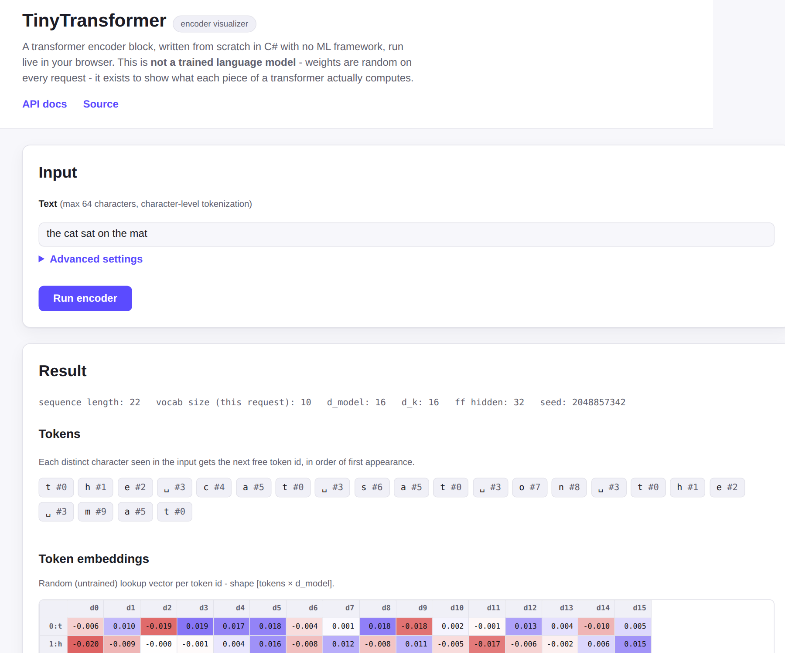

<a name="readme-top"></a>

# TinyTransformer

[](https://github.com/konradcinkusz "Ask me anything")
[](https://github.com/konradcinkusz/tiny-transformer/blob/master/LICENSE.txt "GitHub license")
[](https://github.com/konradcinkusz/tiny-transformer/commits/master "Maintained")
[](https://github.com/konradcinkusz/tiny-transformer/issues "GitHub issues")
[](https://github.com/konradcinkusz/tiny-transformer/pulls "GitHub pull requests")
[](https://github.com/konradcinkusz/tiny-transformer/actions/workflows/ci.yml "CI")

TinyTransformer is a transformer encoder block implemented from scratch in C#, with no
ML/tensor framework anywhere in the dependency graph. It exists to make the mechanics of
"Attention Is All You Need" legible - every matrix multiply, softmax and residual
connection is code you can read top to bottom - and it ships as a live, runnable demo:
an ASP.NET Core API wraps the model, and a small browser UI runs your text through it and
visualizes what comes out at each stage.



## What this is (and is not)

**This is:** a hand-written transformer encoder - embedding lookup, sinusoidal
positional encoding, multi-head self-attention, multi-layer stacking, residual
connections, LayerNorm, and a feed-forward sublayer - runnable from the command line, a
REST API, or a browser, with a unit test for every layer and every backward pass. It
also has a real (if deliberately toy) training story: a hand-derived backward pass and
plain SGD update loop, and a save/load format for persisting trained weights - see the
live demo's "Weights: Random / Trained" toggle, or
`TinyTransformer.Core/Training/EchoTrainingDemo.cs` for the console version.

**This is not:** a trained language model. The "Trained" option in the demo is a small
model overfit to one fixed, five-token synthetic sequence (the "echo" task - predict
each token's own id from its contextualized representation) - it demonstrates that the
training mechanics genuinely work end to end, not anything resembling learned language
understanding. "Random" weights stay the default, and are still the more honest way to
see what an *untrained* transformer computes. Two smaller, related honesty notes:
tokenization is a simple character-level scheme (not BPE/subword - there's no
pretrained vocabulary to load), and there is no decoder (this project is encoder-only
by design). See [`docs/architecture/DECISIONS.md`](docs/architecture/DECISIONS.md) for
the reasoning behind these and other scope choices, including two design diagrams under
`docs/` that predate the training loop actually being built and no longer reflect its
real shape - they're kept for historical context only.

## Quick start

Zero cloud accounts, zero API keys, zero unwritten prerequisites - pick one:

### Option A - Docker (recommended, matches production)

```bash
git clone https://github.com/konradcinkusz/tiny-transformer.git
cd tiny-transformer
docker compose up --build
```

Open **http://localhost:8080**.

### Option B - .NET SDK directly

Requires the [.NET 8 SDK](https://dotnet.microsoft.com/download/dotnet/8.0).

```bash
git clone https://github.com/konradcinkusz/tiny-transformer.git
cd tiny-transformer
dotnet run --project TinyTransformer.Api
```

Open **http://localhost:8080** (the port is fixed in `Properties/launchSettings.json`
so it matches the Docker path above).

### Run the tests

```bash
dotnet test
```

### Run the console demo

A minimal, non-HTTP walkthrough of the same pipeline - useful for stepping through in a
debugger:

```bash
dotnet run --project TinyTransformer.ConsoleApp
```

## How it works

Type a sentence, hit "Run encoder", and the page sends it to `POST /api/encode`, which:

1. **Tokenizes** the text character-by-character (`CharTokenizer`) - each distinct
   character seen gets the next free token id, in order of first appearance.
2. **Looks up embeddings** for each token id (`Embedding`) - a random vector per id by
   default, or a learned one if you pick "Trained" weights (see below).
3. **Adds positional encoding** (`PositionalEncoding`, the classic sinusoidal scheme) -
   without this step, self-attention is provably permutation-*equivariant* (see
   `SelfAttentionTests`), meaning token order carries no information at all.
4. **Runs the requested stack of `TransformerEncoderBlock`s** (one block, one head by
   default; `numHeads`/`numLayers` under "Advanced settings" configure more of each):
   self-attention → residual + LayerNorm → feed-forward → residual + LayerNorm, once per
   layer.
5. Returns the embeddings, the positional encoding table, the attention weights (both a
   per-layer/per-head breakdown and an averaged summary), and the final output - all
   rendered as heatmaps in the browser.

The same seed always reproduces the same randomly-initialized "model" (weights) and
therefore the same output, so a response is replayable by resending it with its own
`seed` value. Picking **"Trained"** weights instead runs a small model pretrained once
at API startup on the fixed toy task described above (see `TrainedModelFactory`) -
`seed` and every other advanced setting are ignored in that mode, since the trained
model's shape and weights are fixed, not derived from the request.

## API reference

Interactive docs (Swagger UI) are served at **`/swagger`** whenever the app is running.

| Endpoint | Method | Description |
|---|---|---|
| `/api/health` | `GET` | Liveness check. |
| `/api/encode` | `POST` | Run text through the encoder block. See below. |

<details>
<summary><code>POST /api/encode</code> request/response</summary>

Every field except `text` is optional:

```json
{
  "text": "the cat sat on the mat",
  "dModel": 16,
  "dK": 16,
  "ffHidden": 32,
  "numHeads": 1,
  "numLayers": 1,
  "seed": 42
}
```

| Field | Range | Default |
|---|---|---|
| `text` | 1-64 characters | *(required unless `useTrainedModel` is true)* |
| `dModel` | 4-64 | 16 |
| `dK` | 2-64 | 16 |
| `ffHidden` | 4-256 | 32 |
| `numHeads` | 1-8 | 1 |
| `numLayers` | 1-6 | 1 |
| `seed` | any integer | a fresh random value, returned in the response |
| `useTrainedModel` | `true`/`false` | `false` |

```json
{
  "tokens": ["t", "h", "e", "␣", "c", "a", "t"],
  "tokenIds": [0, 1, 2, 3, 4, 5, 0],
  "config": { "dModel": 16, "dK": 16, "ffHidden": 32, "numHeads": 1, "numLayers": 1, "seed": 42, "sequenceLength": 7, "vocabSize": 6, "usedTrainedModel": false },
  "embeddings": [[...]],
  "positionalEncoding": [[...]],
  "attentionWeights": [[...]],
  "attentionWeightsPerLayer": [[[[...]]]],
  "encoderOutput": [[...]]
}
```

`attentionWeights` is always `[sequenceLength x sequenceLength]` regardless of
`numHeads`/`numLayers`: it's the last encoder block's attention, averaged
across heads if there is more than one (see
`TransformerEncoderBlock.ForwardWithAttention`). `attentionWeightsPerLayer` is
the full, unaveraged detail behind it - indexed
`[layer][head][sequenceLength][sequenceLength]` - for clients (like the
frontend's layer/head selector) that want to inspect an individual layer or
head; `attentionWeights` is exactly the average of `attentionWeightsPerLayer`'s
last entry.

**`useTrainedModel: true`** switches from a fresh, randomly-weighted model to
a small model pretrained on Phase 2's toy "echo" task (see
`TinyTransformer.Api.Services.TrainedModelFactory`), trained once at process
startup and served from then on via `TinyTransformerModel`'s save/load format.
Every other field is ignored in this mode - the trained model always runs on
its own fixed demo token sequence, not on `text`, because its tokenizer has no
fixed global vocabulary in common with arbitrary text (see
`EncodeRequest`'s doc comment for why). `config.usedTrainedModel` reports which
mode actually ran; `config.seed` is meaningless (and always `0`) when it's
`true`.

Invalid input returns `400` with an RFC 9110 validation-problem body
(`{ "errors": { "text": ["Text is required."] } }`); exceeding the rate limit (30
requests/minute per client) returns `429` with `{ "error": "...", "retryAfter": <seconds> }`.

</details>

## Project layout

```
TinyTransformer.Core/          the model - Embedding, PositionalEncoding, SelfAttention,
                                LayerNorm, FeedForwardAuto, TransformerEncoderBlock, MathOps
TinyTransformer.Api/           ASP.NET Core minimal API + static frontend (wwwroot/)
TinyTransformer.ConsoleApp/    command-line walkthrough of the same pipeline
TinyTransformer.Tests/         unit tests for TinyTransformer.Core
TinyTransformer.Api.Tests/     integration tests for TinyTransformer.Api (WebApplicationFactory)
docs/architecture/             design decisions and scope notes
```

## Architecture & design decisions

This repository was reviewed against
[`konradcinkusz/architecture-standards`](https://github.com/konradcinkusz/architecture-standards),
a cross-repo reference architecture. Most of that architecture targets multi-service
systems with user accounts and cloud deployment, which doesn't describe this project -
[`docs/architecture/DECISIONS.md`](docs/architecture/DECISIONS.md) records exactly what
was applied here, what was deliberately left out, and why, rather than either
cargo-culting the whole thing or applying nothing and staying silent about it.

## Contributing

Issues and PRs are welcome - see the templates under `.github/`. CI (`dotnet test`,
Docker build, CodeQL, and a secret scan) runs on every PR. For local dev setup, what's
expected to pass before opening a PR, and a worked example of adding a new layer, see
[`CONTRIBUTING.md`](CONTRIBUTING.md).

<p align="right">(<a href="#readme-top">back to top</a>)</p>
